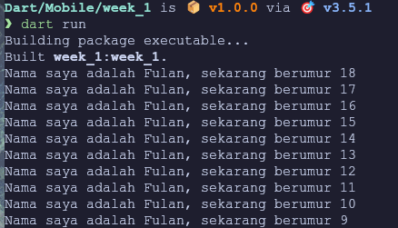

# Pemrograman Mobile - Bagian 1
> Nama     : Ahmad Aria Adi Saputra <br>
> Kelas    : TI-3F / 02 <br>
> NIM      : 2241720247

## Soal 1
- Modifikasilah kode pada baris 3 di VS Code atau Editor Code Favorit Anda berikut ini agar mendapatkan keluaran (output) sesuai yang diminta
> Jawab : 
```dart
typedef void Callback(int someNumber);

void main() {
  loopThrough(printSomething,10,0, 9);
}

void printSomething(int someNumber) {
  print('Nama saya adalah Fulan, sekarang berumur $someNumber');
}

void loopThrough(Callback doSomething, int maxLoopIndex, int startFromIndex, int someNumberToPrint){
  for (int i = startFromIndex; i < maxLoopIndex; i++) {
    doSomething(someNumberToPrint++);
  }
}
```


# Soal 2
- Mengapa sangat penting untuk memahami bahasa pemograman Dart sebelum kita menggunakan framework Flutter? Jelaskan!
> Jawab : 
> Karena Dart merupakan bahasa pemrograman yang digunakan dalam framework *Flutter* sehingga penting untuk memahami fundamental dari dart itu sendiri agar tidak kerepotan pada saat menggunakan Flutter.

# Soal 3
- Rangkumlah materi dari codelab ini menjadi poin-poin penting yang dapat Anda gunakan untuk membantu proses pengembangan aplikasi mobile menggunakan framework Flutter.
> Jawaban:
>      Getting Started with Dart
    Tujuan Dart adalah menggabungkan kelebihan dari sebagian besar bahasa tingkat tinggi dengan fitur-fitur Bahasa pemograman terkini, yaitu :

>        Productive Tooling : Dart menyediakan alat-alat produktif seperti analisis kode, plugin IDE, dan ekosistem paket yang besar.
        Garbage Collection : Dart menangani dealokasi memori secara otomatis, terutama untuk objek yang tidak lagi digunakan.
        Type Annotations (Opsional) : Dart menyediakan keamanan dan konsistensi dalam mengelola data, meskipun hal ini opsional.
        Statically Typed : Dart menggunakan type-safe dan type inference untuk menemukan bug saat kompilasi, meskipun tipe data bersifat opsional
        Portability : Dart dapat dikompilasi ke JS untuk web dan kode native untuk ARM dan x86
        Relevansi Dart dengan Flutter : Pengembangan flutter sendiri sepenuhnya menggunakan dart, sehingga pemahaman tentang dart akan membuat pengembangan flutter lebih nyaman dan produktif.

>    The evolution of Dart

>        Diluncurkan pada 2011 : Versi stabil dirilis pada tahun 2013, dengan perubahan besar pada dart 2.0 di akhir tahun 2018.
        Peralihan fokus : Awalnya Dart untuk pengembangan web sebagai ganti JS, kini fokus pada pengembangan mobile, termasuk flutter
        Memecahkan masalah JavaScript : Dart dirancang untuk memberikan ketangguhan yang tidak dimiliki JS, menjadi alternatif yang lebih baik
        Performa dan Alat Modern : Dart menawarkan performa terbaik dan alat modern untuk berskala besar dengan plugin IDE yang stabil
        Kuat dan Fleksibel : Menggabungkan type annotations opsional dan fitur OOP untuk keseimbangan fleksibilitas dan ketangguhan
        Bahasa Modern dan Lintas Perform : Dart meningkatkan fitur-fiturnya untuk mendukung pengembangan lintas platform dengan fleksibilitas tinggi, membuatnya menjadi pilihan yang ideal untuk Flutter

>    How Dart Works

>        Eksekusi kode dart : Dilakukan melalui dua cara, Dart Virtual Machines (VMs) dan JS compilations
        Dua Mode Kompilasi Dart :
        Kompilasi JIT (Just-In-Time) : Kode sumber dikompilasi sesuai kebutuhan, digunakan untuk pengembangan aplikasi dengan fitur seperti debugging dan hot reload
        Kompilasi AOT (Ahead-Of-Time) : Kode dikompilasi sebelumnya, memberikan performa tinggi namun tanpa fitur debugging dan hot reload. Lingkungan Dart : Eksekusi kode dart membutuhkan runtime systems, Dart core libraries, dan garbage collectors
        Hot Reload : Fitur terkenal flutter yang memungkinkan perubahan kode diterapkan dengan cepat, berbasis compiler Dart JTI, mendukung pengembangan perangkat lunak yang cepat dan berkualitas tinggi
        Pentingnya memahami dasar dart : Memahami konsep dasar Dart sebelum menggunakannya.# Tugas Praktikum

# Soal 4
- Buatlah slide yang berisi penjelasan dan contoh eksekusi kode tentang perbedaan Null Safety dan Late variabel ! (Khusus soal ini kelompok berupa link google slide)
- Kumpulkan jawaban Anda di spreadsheet pada tautan yang telah disediakan di grup telegram. Untuk soal nomor 1 sampai 3 push repo GitHub Anda.
> Jawaban :
> [PPT_Canva](https://www.canva.com/design/DAGP4CyWbhM/ClanGIthh-l2LqmgDC6P9A/edit?utm_content=DAGP4CyWbhM&utm_campaign=designshare&utm_medium=link2&utm_source=sharebutton)
