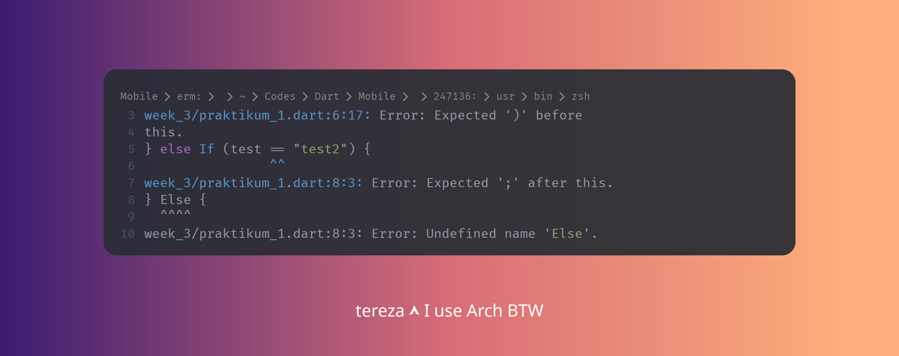
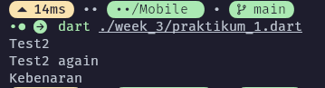
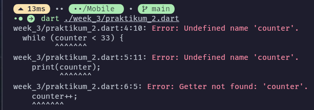
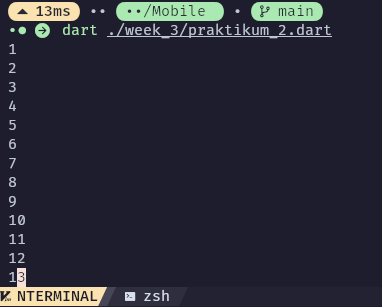
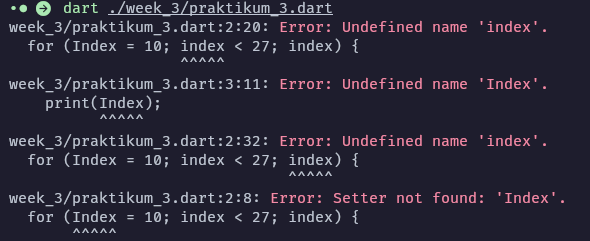
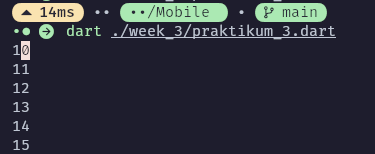
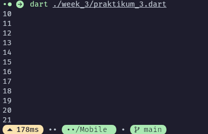
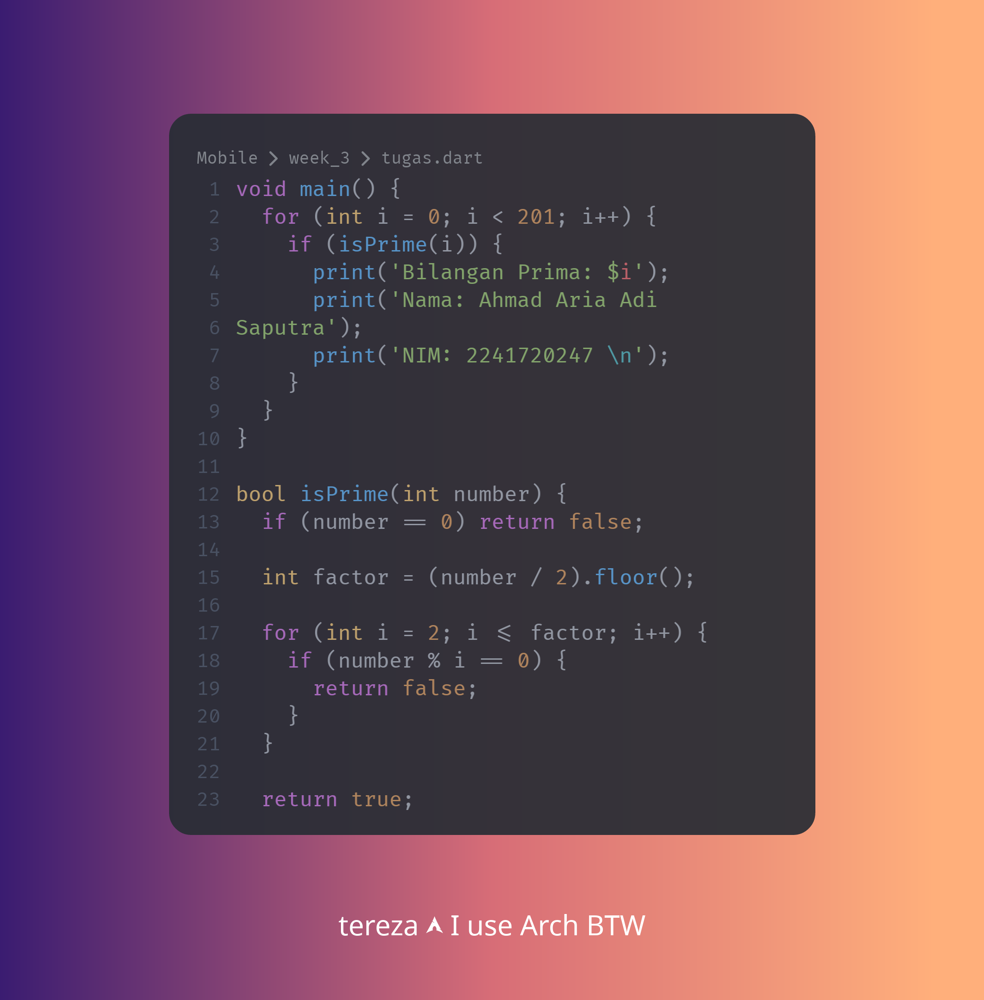
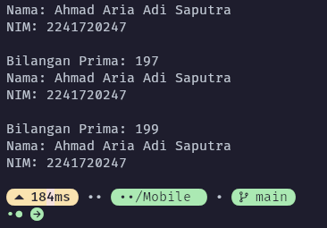

# Pemrograman Mobile - Pertemuan 3

<table>
  <thead>
    <th colspan="2" style="text-align: center;">Pertemuan 3</th>
  </thead>
  <tbody>
    <tr>
      <td>NIM</td>
      <td>2241720247</td>
    </tr>
    <tr>
      <td>Nama</td>
      <td>Ahmad Aria Adi Saputra</td>
    </tr>
</table>

# Praktikum 1: Menerapkan Control Flows ("if/else")

#### Langkah 1:
```dart
String test = "test2";
if (test == "test1") {
   print("Test1");
} else If (test == "test2") {
   print("Test2");
} Else {
   print("Something else");
}

if (test == "test2") print("Test2 again");
```

#### Langkah 2:

Setelah melakukan langkah 1 terdapat error sebagai berikut:


Hal tersebut terjadi karena dart bersifat *case-sensitive* jadi jika menggunakan ```If``` atau ```Else``` maka dart tidak akan mengenali perintah tersebut.

#### Langkah 3:
```dart
String test = "true";
if (test) {
   print("Kebenaran");
}
```


 - Keterangan = sebelumnya terjadi error dimana variabel test sudah exist sehingga perlu membuat variabel baru dan kondisi if tidak ada yang dapat dibandingkan sehingga terjadi error perlu menambahkan pembanding 

# Praktikum 2: Menerapkan Perulangan "while" dan "do-while"

#### Langkah 1:
```dart
while (counter < 33) {
  print(counter);
  counter++;
}
```

#### Langkah 2:

Hasil eksekusi program di atas adalah:

 - Keterangan = Error diatas terjadi karena counter belum di deklarasi menjadi variabel sehingga perlu dibuat dulu variabel counter 

#### Langkah 3:
```dart
do {
  print(counter);
  counter++;
} while (counter < 77);
```
<hr/>


- Keterangan = Jika hanya menambahkan kode diatas tanpa deklarasi counter seperti pada langkah 1, maka akan menyebabkan error yang sama seperti langkah 1

# Praktikum 3: Menerapkan Perulangan "for" dan "break-continue"

#### Langkah 1:
```dart
for (Index = 10; index < 27; index) {
  print(Index);
}
```

#### Langkah 2:

 - Keterangan = error diatas yang pertama terjadi karena index menggunakan huruf kapital sebagai awalan dan itu tidak boleh sehingga harus diubah menjadi huruf kecil dan variabel index belum terdeklarasi sehingga harus dideklarasi terlebih dahulu 

<hr/>

```dart
  for (int index = 10; index < 27; index++) {
    print(index);
  }
```



#### Langkah 3:
```dart
If (Index == 21) break;
Else If (index > 1 || index < 7) continue;
print(index);
```

 - Keterangan = Pada kode diatas butuh perulangan for dan deklarasi index terlebih dahulu, sehingga pada gambar berikut sudah disertai pembenaran dari kode diatas
# Tugas

Buatlah sebuah program yang dapat menampilkan bilangan prima dari angka 0 sampai 201 menggunakan Dart. Ketika bilangan prima ditemukan, maka tampilkan nama lengkap dan NIM Anda.

#### Kode: 



#### Output:



