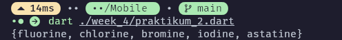

# Pemrograman Mobile - Pertemuan 4

<table>
  <thead>
    <th colspan="2" style="text-align: center;">Pertemuan 3</th>
  </thead>
  <tbody>
    <tr>
      <td>NIM</td>
      <td>2241720247</td>
    </tr>
    <tr>
      <td>Nama</td>
      <td>Ahmad Aria Adi Saputra</td>
    </tr>
</table>


## Praktikum 1

#### Langkah # 
```dart
var list = [1, 2, 3];
assert(list.length == 3);
assert(list[1] == 2);
print(list.length);
print(list[1]);

list[1] = 1;
assert(list[1] == 1);
print(list[1]);
```
- Keterangan: Menjelaskan tentang basic dari list, mulai dari memodifikasi elemen, cara mengakses elemen, dan penggunaan assertion.

#### Langkah 2


#### Langkah 3
```dart
  final List<String?> list = List.filled(5, null);
  list[1] = 'Ahmad Aria Adi Saputra';
  list[2] = '2241720247';

  assert(list.length == 5);
  assert(list[1] == 'Ahmad Aria Adi Saputra');
  assert(list[2] == '2241720247');
  print(list.length);
  print(list[1]);
  print(list[2]);

```

- Keterangan: kode diatas mendeklarasi variabel final dengan maksimal index sebangak 5 dan variabel yang dideklarasi dapat menampung nilai string atau null dengan index ke 1 dan ke 2 dari list di isi dengan nama dan NIM masing-masing.

## Praktikum 2
#### Langkah # 
```dart
var halogens = {'fluorine', 'chlorine', 'bromine', 'iodine', 'astatine'};
print(halogens);
```
#### Langkah 2

- Keterangan: kode diatas menjelaskan tentang penggunaan set mulai dari cara deklarasi set dan print cara print Set.

#### Langkah 3
```dart
var names1 = <String>{};
Set<String> names2 = {};
var names3 = {};

names1.add('Ahmad Aria Adi Saputra');
names1.add('2241720247');

names2.addAll({'Ahmad Aria Adi Saputra', '2241720247''});

print(names1);
print(names2);
print(names3);
```

- Keterangan: pada kode sebelumnya belum ditambahkan fungsi .add() dan .addAll() yang dimana .add() berguna untuk tambah satu persatu dimasukkan ke dalam set names1 sedangkan untuk .addAll() berguna untuk menambahkan nilai secara sekaligus ke dalam set names2.

## Praktikum 3
#### Langkah 1
```dart
var gifts = {
  'first': 'partridge',
  'second': 'turtledoves',
  'fifth': 1
};

var nobleGases = {
  2: 'helium',
  10: 'neon',
  18: 2,
};

print(gifts);
print(nobleGases);
```
#### Langkah 2

- Keterangan: disini deklarasi maps gifts dan nobleGases, dimana gifts dan nobleGases berisi 3 key dengan masing masing value

#### Langkah 3
```dart
  var mhs1 = Map<String, String>();
  gifts['first'] = 'partridge';
  gifts['second'] = 'turtledoves';
  gifts['fifth'] = 'golden rings';

  var mhs2 = Map<int, String>();
  nobleGases[2] = 'helium';
  nobleGases[10] = 'neon';
  nobleGases[18] = 'argon';

  gifts['name'] = 'Aria';
  gifts['NIM'] = '2241720247';

  nobleGases[1] = 'Aria';
  nobleGases[3] = '2241720247';

  mhs1['name'] = 'Aria';
  mhs1['NIM'] = '2241720247';

  mhs2[1] = 'Aria';
  mhs2[2] = '2241720247';

  print(gifts);
  print(nobleGases);
  print(mhs1);
  print(mhs2);
```


- Keterangan: disini pada maps gifts dengan value fifth di edit ke golden rings dan maps nobleGases dengan value 18 di edit ke argon, disini jua maps gifts dan nobleGases ditambahkan value baru yaitu nama dan NIM, dan juga ada deklarasi maps baru yaitu mhs1 dan mhs2 dengan isi value nya adalah nama dan NIM.

## Praktikum 4
#### Langkah 1
```dart
var list1 = [1, 2, 3];
var list2 = [0, ...list1];
print(list1);
print(list2);
print(list2.length);
```

#### Langkah 2

- Keterangan: disini list dengan nama list2 menginclude semua elemen dari list1 ke list2, kemudian panjang dari list2 di print yang dimana ada sebanyak 4 karena menginclude dari list1 dan 1 index awal dari list2.

#### Langkah 3
```dart
list1 = [1, 2, null];
print(list1);
var list3 = [0, ...?list1];
print(list3.length);
```

- Keterangan: dari kode diatas terdapat error dimana elemen type null tidak bisa di sandingkan dengan elemen type int, perlu diubah terlebih dahulu menjadi seperti berikut `List<int?> list1 = [1, 2, 3];` baru list1 dapat di isikan nilai null

#### Langkah 4 
```dart
bool promoActive = true;
var nav = ['Home', 'Furniture', 'Plants', if (promoActive) 'Outlet'];
print(nav);

promoActive = false;
nav = ['Home', 'Furniture', 'Plants', if (promoActive) 'Outlet'];
print(nav);
```


#### Langkah 5
```dart
String login = 'Manager';
var nav2 = [
  'Home',
  'Furniture',
  'Plants',
  if (login == 'Manager') 'Inventory'
];
print(nav2);

login = 'User';
nav2 = [
  'Home',
  'Furniture',
  'Plants',
  if (login == 'Manager') 'Inventory'
];
print(nav2);
```

- Keterangan: untuk kode sebelumnya belum lengkap yang dimana variabel login belum di deklarasi dan diberi nilai string yaitu manager sehingga kalau di lengkapi seperti kode diatas, maka ketika login dipanggil pada list nav2 dan bernilai sama dengan variabel login yang dideklarasi di awal pada list nav2 maka inventory akan dimasukkan kedalam nav2 begitu juga ketika isi nilai dari variabel login tidak sesuai dengan kondisi if, maka inventory tidak akan dimasukkan ke dalam list

#### Langkah 6
```dart
var listOfInts = [1, 2, 3];
var listOfStrings = ['#0', for (var i in listOfInts) '#$i'];
assert(listOfStrings[1] == '#1');
print(listOfStrings);
```

- Keterangan: kode diatas mendemonstrasikan penggunaan list baru berdasarkan dari list yang sudah ada, kegunaan collection for adalah untuk mempermudah pembacaan list sehingga list lebih mudah untuk di maintain

## Praktikum 5
#### Langkah 1
```dart
  var record = ('first', a: 2, b: true, 'last');
  print(record);
```
#### Langkah 2

- Keterangan: dari kode diatas menjelaskan kegunaan dari record yaitu mengumpulan beberapa value yang berbeda menjadi satu grup yang sama

#### Langkah 3
```dart
void main() {
  var record = ('first', a: 2, b: true, 'last');
  print(record);

  var intRecord = (1, 2);
  var swappedRecord = tukar(intRecord);
  print(swappedRecord);
}

(int, int) tukar((int, int) record) {
  var (a, b) = record;
  return (b, a);
}
```

- Keterangan: disini function tukar() dipanggil di dalam main() karena sebelumnya hanya membuat function tukar() tanpa memanggil function tersebut, ketika function tukar dipanggil hanya bisa menukar 2 index saja dan dari record yang sebelumnya dibuat dengan isi total 4 index tidak bisa digunakan karena yang bisa ditukar hanya dari 2 index dan perlu dipanggil

#### Langkah 4
```dart
(String, int) mahasiswa = ('Ahmad Aria Adi Saputra', 2241720247);
print(mahasiswa);
```

- Keterangan: disini pembuatan record dengan deklarasi tipe variabel yang pertama bertipe string dan yang kedua bertipe int
#### Langkah 5
```dart
var mahasiswa2 = ('first', a: 2, b: true, 'last');

print(mahasiswa2.$1);
print(mahasiswa2.a);
print(mahasiswa2.b);
print(mahasiswa2.$2);
```


- Keterangan: Disini record mahasiswa2 memanggil masing masing dari index yang dipanggil yang dimana penggunaan $1 atau $2 memanggil nilai yang nilainya string sedangkan a atau b memanggil variabel yang dideklarasi di dalam record

## Tugas
#### Soal
1. Silakan selesaikan Praktikum 1 sampai 5, lalu dokumentasikan berupa screenshot hasil pekerjaan Anda beserta penjelasannya!
2. Jelaskan yang dimaksud Functions dalam bahasa Dart!
3. Jelaskan jenis-jenis parameter di Functions beserta contoh sintaksnya!
4. Jelaskan maksud Functions sebagai first-class objects beserta contoh sintaknya!
5. Apa itu Anonymous Functions? Jelaskan dan berikan contohnya!
6. Jelaskan perbedaan Lexical scope dan Lexical closures! Berikan contohnya!
7. Jelaskan dengan contoh cara membuat return multiple value di Functions!
8. Kumpulkan berupa link commit repo GitHub pada tautan yang telah disediakan di grup Telegram!

#### Jawaban
1. ----
2. Functions merupakan sebuah blok kode yang digunakan untuk melakukan suatu tugas tertentu. Functions juga bermanfaat agar kita tidak perlu menulis ulang kode yang sama untuk beberapa tugas yang sama dan dengan function kode yang ditulis jadi lebih mudah dibaca dan dimaintenance.
3. Jenis-jenis Parameter pada function:
    - Required Parameter: Parameter yang harus diisi oleh user.
    - Default Parameter: Parameter yang diisi oleh user, namun jika user tidak mengisi parameter tersebut maka default valuenya akan digunakan.
    - Named Parameter: Parameter yang memiliki nama.
    - Optional Parameter: Parameter yang tidak harus diisi oleh user.
    > Syntax:
    > ```dart
    >    void main(List<String> args) {
    >      // Required Parameter
    >      void requiredParameter(String name) {
    >        print('Hello $name');
    >      }
    >
    >      requiredParameter('Aria'); // Output: Hello Aria
    >
    >      // Default Parameter
    >      void defaultParameter(String name = 'World') {
    >        print('Hello $name');
    >      }
    >
    >      defaultParameter(); // Output: Hello World
    >      defaultParameter('Aria'); // Output: Hello Aria
    >
    >      // Named Parameter
    >      void namedParameter({String name = 'World'}) {
    >        print('Hello $name');
    >      }
    >
    >      namedParameter(name: 'Aria'); // Output: Hello Aria
    >
    >      // Optional Parameter
    >      void optionalParameter(String name, [int? age = 'unknown']) {
    >        print('Hello $name, your age is $ageValidated');
    >      }
    >
    >      optionalParameter('Aria'); // Output: Hello Aria, your age is unknown
    >      optionalParameter('Aria', 21); // Output: Hello Aria, your age is 21
    >    }
    ```
4. Pada dart function as first-class object berarti kita dapat memperlakukan suatu fungsi sebagai nilai dari tipe lain. Jadi, Anda bisa menjadikan fungsi ke sebuah variabel, menjadikan fungsi sebagai argumen pada fungsi lain, dan mengembalikan fungsi dari sebuah fungsi.
    > Syntax:
    > ```dart
    >      void printElement(int element) {
    >        print(element);
    >      }
    >
    >      var list = [1, 2, 3];
    >
    >      list.forEach(printElement);
    >    }
    ```
5. Annonymous Functions adalah sebuah fungsi yang tidak memiliki nama.
    > Syntax:
    > ```dart
    >      void main() {
    >        var list = [1, 2, 3];
    >
    >        list.forEach((element) {
    >          print(element);
    >        });
    >      }
    > ```
6. Perbedaan Lexical scope dan Lexical closures:
    - Lexical scope: adalah konsep di mana variabel dapat diakses berdasarkan lokasi variabel tersebut didefinisikan dalam kode.
    > Syntax:
    > ```dart
    > ``void main(List<String> args) {
    >   var list = [1, 2, 3];
    >
    >   list.forEach((element) {
    >     print(element);
    >   });
    > }
    > ```
    - Lexical closure: adalah konsep di mana variabel dapat diakses berdasarkan lokasi variabel tersebut didefinisikan dalam kode, dan variabel tersebut juga dapat diakses di dalam fungsi yang dideklarasikan di dalam variabel tersebut.
    -   > Syntax:
        > ```dart
        > void main(List<String> args) {
        > function makeCounter() {
        >   let count = 0; // Variabel privat
        >
        >   return function() {
        >       count += 1; // Mengakses variabel dari makeCounter
        >       return count;
        >   };
        > }
        >
        > const increment = makeCounter();
        > console.log(increment()); // Output: 1
        > console.log(increment()); // Output: 2
        > console.log(increment()); // Output: 3
        > }
        > ```
7. Untuk membuat return multiple value di dart, kita dapat menggunakan beberapa cara, yaitu:
    - Menggunakan Class
        > Syntax:
        > ```dart
        > class Person {
        >   String name;
        >   int age;
        >
        >   Person(this.name, this.age);
        > }
        >
        > Person getPerson() {
        >   return Person('Aria', 21);
        > }
        >
        > void main(List<String> args) {
        >   var person = getPerson();
        >   print('Name: ${person.name}, Age: ${person.age}'); // Output: Name: Aria, Age: 21
        > }
        ```
    - Menggunakan List
        > Syntax:
        > ```dart
        > void main(List<String> args) {
        >   List<dynamic> getList() {
        >     List<String> person = ['Budy', 'Aria'];
        >
        >     return person;
        >   }
        >
        >   var list = getList();
        >   print(list[0]); // Output: Budy
        >   print(list[1]); // Output: Aria
        > }
        ```
    - Menggunakan Map
        > Syntax:
        > ```dart
        > void main(List<String> args) {
        >   Map<String, dynamic> getMap() {
        >     Map<String, String> person = {
        >       'name': 'Aria',
        >       'age': '21',
        >     };
        >
        >     return person;
        >   }
        >
        >   var map = getMap();
        >   print(map['name']); // Output: Aria
        >   print(map['age']); // Output: 21
        > }
        ```
8. Yes...
